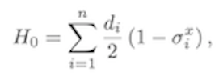
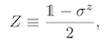
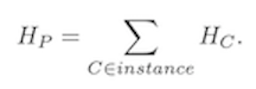

# Adiabatic evolution for solving an Exact Cover problem.

Code at: [https://github.com/Quantum-TII/qibo/tree/adiabatic-3SAT/examples/adiabatic-3SAT](https://github.com/Quantum-TII/qibo/tree/adiabatic-3SAT/examples/adiabatic-3SAT)

## Introduction

Adiabatic quantum computation aims to reach the ground state of a problem Hamiltonian encoding the solution of a hard problem, by adiabatically evolving a system from the ground state of a known, easy to prepare, Hamiltonian to the problem Hamiltonian.

An Exact Cover instance of a 3SAT problem is characterized by a set of clauses containing 3 bits that are considered satisfied if one of them is in position 1, while the other remain at 0. The solution of this instance is bitstring that fulfills all the clauses at the same time.

## Adiabatic evolution

Adiabatic compution deals with finding the ground state of a Hamiltonian that encodes the solution of a computational problem. This has to be mapped to the time dependent Hamiltonian in the form


where H_0 and H_p are the initial and problem Hamiltonian respectively, and s(t) defines the schedule that the adiabatic evolution follows. How fast this evolution can be performed depends on the minimum gap energy of the system during the evolution, that is the difference of energy between the ground state and the first excited state along the schedule. The smaller the gap energy the slower the evolution has to be.

The initial Hamiltonian used in this example is the following, 



which has a ground state of the equal superposition of all possible computational states.

As for the problem Hamiltonian that encodes the solution of an Exact cover problem, first we define the operator



that can be used to create a Hamiltonian with a ground state when the Exact Cover clause is satisfied. This clause Hamiltonian reads


where the indices i, j, k represent the three different qubits that the particular clause adresses. After this is defined, the problem Hamiltonian only needs to add up all clause Hamiltonians, so that the only state that remains at 0 energy will be the one that fulfills at the same time




## How to run the example?

Run the file `main.py` from the console to perform an adiabatic evolution for an instance of 8 qubits.

The program supports the following arguments:

- `--nqubits` (int) allows for instances with different number of qubits (default=8).
- `--instance` (int) choose intance to use (default=1).
- `--T` (float) set the total time of the adiabatic evolution (default=10).
- `--dt` (float) set the interval of the calculations over the adiabatic evolution (default=1e-2).
- `--solver` (str) set the type of solver for the evolution (default='exp').
- `--plot` add this modifier to output energy and gap plots during the evolution. Capped under 14 qubits due to memory.
- `--trotter` add this modifier to perform the trotterization of the Hamiltonian.

The program returns:

- The most common solution found after the evolution.
- The probability of the most common solution.
- `{}_qubits_energy.png` plots detailing the evolution of the lowest two eigenvalues for {} qubits. **(if enabled)**
- `{}_qubits_gap.png` plots detailing the evolution of the gap energy for {} qubits. **(if enabled)**

Initially supported number of qubits are [4, 8, 10, 12, 14, 16, 18, 20, 22, 24, 26, 28, 30], with 10 different instances for qubits 8 and up.

The functions used in this example, including problem hamiltonian creation are included in `functions.py`.

## Create your own instances

An example of an instance for 4 qubits reads:

```text
 4 3 1
0 1 0 0
 1 2 3
 2 3 4
 1 2 4
```

The first line includes:
- number of qubits
- number of clauses
- number of 1's in the solution

The second line is the solution of the instance.

The following lines correspond to the three qubits present in each clause.

Should the solution not be known, leave an empty line in place of the solution as well as remove the number of 1's in the solution.
