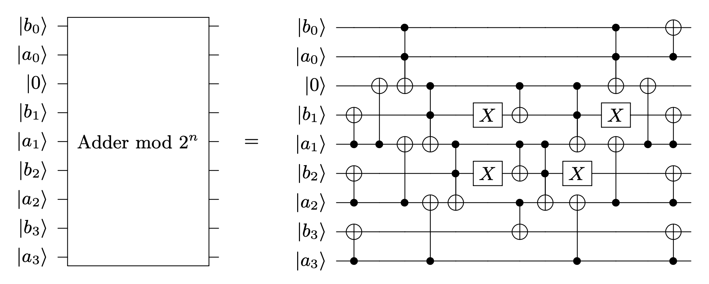
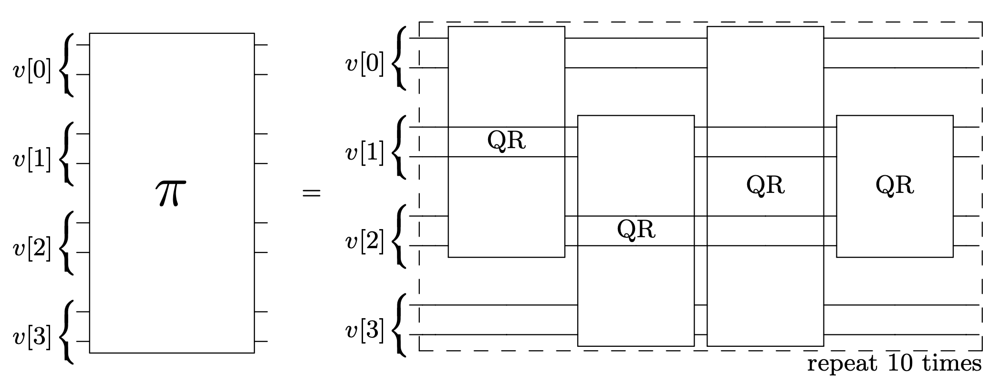
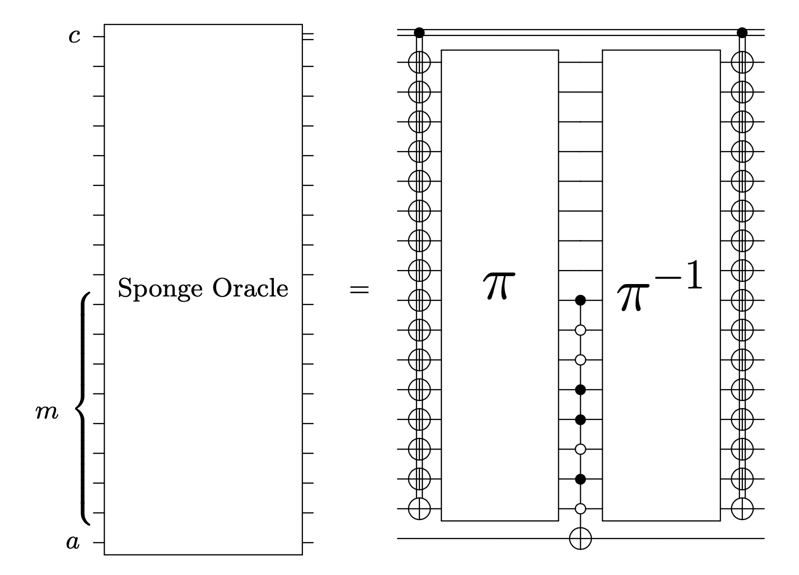
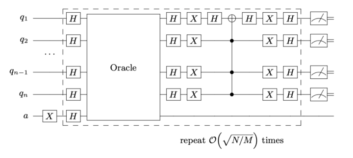

# Grover's Algorithm for solving a Toy Sponge Hash function

Code at: [https://github.com/Quantum-TII/qibo/tree/master/examples/grover3sat](https://github.com/Quantum-TII/qibo/tree/hash-grover/examples/hash-grover)

## Introduction

Grover's Algorithm is an example of the advantages a quantum computer has over a classical computer in the task of searching databases. This program applies a Grover search on a brute force check of preimages for a Toy Sponge Hash construction.

Symmetric cryptographic primitives, such as hash functions, are believed to be quantum resistant. The security of hash functions is measured in terms of resistance against collision finding, preimage and second preimage finding, and their multi-target variants. Therefore the first approach is to gain the quadratic speed-up from Grover's algorithm. In the following we present an explicit construction for a Toy Sponge Hash function based on the Chacha family of permutations in order to study the scaling of Addition-Rotation-eXclusive (ARX) hash functions.

## Grover's search algorithm

The algorithm proposed by Grover [arXiv:quant-ph/9605043](https://arxiv.org/abs/quant-ph/9605043) achieves a quadratic speed-up on a brute-force search of this preimage finding problem.

This program builds the necessary parts of the algorithm in order to simulate this algorithm. Crucially, Grover's algorithm requires an oracle that is problem dependent, which changes the sign of the solution of the problem. More details can be found on the original paper but the outline goes a follows.

### Oracle

The Grover Oracle needs to apply the Toy Sponge Hash construction in a reversible way. 

The Chacha permutation [chacah-20080120](https://cr.yp.to/chacha/chacha-20080120.pdf) used as the base for the Toy Sponge Hash construction is built on top of a QuarterRound module. As a a quantum circuit this Quarter Round can be constructed using a quantum adder modulo `2^n`, CNOT gates between registers and a qubit shuffling, represented as a gate with a circle-arrow. This shuffle is achived as a qubit relabelling and does not incur any quantum cost. This circuit can be represented as

where any version of a quantum adder can be used. For this circuit we use a qubit-efficient adder put forward in [arXiv:quant-ph/0410184](https://arxiv.org/abs/quant-ph/0410184) where only one ancilla is necessary and is reused throughout the circuit. For the specific case of an adder modulo `2^n` the quantum circuit used can be seen in the following image.

With the Quarter Round constructed we can arrange the Chacha permutation in a reversible way through a quantum circuit by arranging them as needed.

The full oracle requires of a classical wire that stores the first, deterministic permutation. Also, once the Chacha permutation is performed and the amplitude for the solution state is flipped, the permutation must be undone as the diffusion transform has to be applied on the message space.

### Diffusion transform

After the sign change of the solution states, an inversion about average amplifies their amplitude. This is at the core of Grover's search algorithm. This operator, also known as Diffusion transform, can be constructed by a set of Hadamard gates on all qubits, a multi-qubit gate that changes the sign of the |0000...00> state, and another set of H gates.

### Building the algorithm

The quantum register is started with Hadamard gates on all qubits encoding the problem, and an X gate followed by a Hadamard gate on the Grover ancilla, used to change the sign of the solution.

Should the total number of preimages be known, the oracle and diffusion transform are applied (π/4)sqrt(N/M) times, where N is the total number of possible outcomes and M is the number of preimages.

If that is not the case, the code follows the algorithm put forward in [arXiv:quant-ph/9605034](https://arxiv.org/abs/quant-ph/9605034).

- The circuit is initialized with `m = 1` and `lambda = 6/5`.
- Choose `j` randomly as an integer equal or lower than `m`.
- Apply `j` Grover steps and measure.
- If the measured state outputs the desired hash: `exit`.
- If not, set `m = min(lamda*m, sqrt(N))` and repeat from the second step.

The quantum circuit for the Grover search algorithm with any oracle takes the form:

## How to run the example?

Run the file `main.py` from the console to find a preimage for hash value '10100011' (163) using 18 qubits.

Changing the argument `--hash` (int) allows find preimages of different hash values. Keep the hash value equal or below 8 bits.

Changing the argument `--bits` (int) allows to fine tune the maximum number of bits of the hash function. If less than needed, the minimum amount of bits required will be used.

Should the number of preimages be known, please add them in `--collisions` (int), which is set to `None` by default. 

Some examples for hash values with known collisions:

- 187 (1 collision)
- 163 (2 collisions)
- 133 (3 collisions)
- 113 (4 collisions)

The program returns:

- If a solution has been found and the value of the preimage.
- Total number of function calls required.

The functions used in this example, including gate by gate decompositions of both the oracle and diffusion transform are included in `functions.py`.