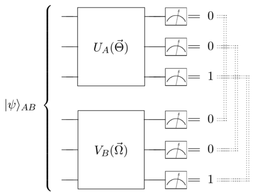

# Quantum Singular Value Decomposer

Code at: [https://github.com/Quantum-TII/qibo/tree/master/examples/qsvd](https://github.com/Quantum-TII/qibo/tree/master/examples/qsvd)

## The problem
Much progress has been made towards a better understanding of bipartite and multipartite entanglement of quantum systems in the last decades. Among the many figures of merit that have been put forward to quantify entanglement, the von Neumann entropy stands out as it finely reveals the quantum correlations between subparts of the system. Yet, the explicit computation of this entropy, as well as many other bipartite measures of entanglement, relies on a clever decomposition of the tensor that describes a two-party system, and in general, it demands a large investment of computational resources.

## Implementing the solution
The code herein aims at reproducing the results of the manuscript ["Quantum Singular Value Decomposer"](https://journals.aps.org/pra/abstract/10.1103/PhysRevA.101.062310). We are going to implement a quantum circuit that produces the Schmidt coefficients of the singular value decomposition of a pure bipartite state. In turn, these coefficients will be used to compute the von Neumann entropy. We call this circuit Quantum Singular Value Decomposer (QSVD). The QSVD is made of two unitaries, each acting on a separate subpart of the system, that are determined in a variational way. The frequencies of the outputs in the computational basis for the final state in the circuit deliver the eigenvalues of the decomposition (i.e. the Schmidt coefficients) without further treatment. From them, the von Neumann entropy readily follows. Moreover, the eigenvectors of the decomposition can be recreated from the direct action of the adjoint of the unitaries that conform the system on computational-basis states.

The key ingredient of the algorithm is to train the circuit on exact coincidence of outputs for both subsystems. This is a subtle way to force a diagonal form onto the state. It also provides an example of a quantum circuit which is not trained to minimize some energy, but rather to achieve a precise relation between the superposition terms in the state.

## How to run an example

    # We import the QSVD class

    from qsvd import QSVD

    # We choose a number of qubits, and the size of the bipartition with qubits 0,1,...,subsize-1
     
    nqubits = 6
    subsize = 3 

    # We initialize the QSVD

    Qsvd = QSVD(nqubits, subsize)

    # We choose an intial random state

    import numpy as np

    initial_state = np.random.rand(2**nqubits)
    initial_state = initial_state / np.linalg.norm(initial_state)

    # We choose the number of layers and initial random parameters

    nlayers = 4
                        # if Rx,Rz,Rx rotations are employed in the anstaz
    initial_parameters = 2*np.pi * np.random.rand(6*nqubits*nlayers+3*nqubits) 

                             # if Ry rotations are employed in the anstaz
    #initial_parameters = 2*np.pi * np.random.rand(2*Nqubits*Nlayers+Nqubits) 

    # We train the QSVD

    cost_function, optimal_angles = Qsvd.minimize(initial_parameters, nlayers, init_state=initial_state,
                                              nshots=10000, RY=False, method='Powell')

    # We use the optimal angles to compute the Schmidt coefficients of the bipartition

    Schmidt_coefficients = Qsvd.Schmidt_coeff(optimal_angles, nlayers, initial_state)
    print('Schmidt coefficients: ', Schmidt_coefficients)

    # We compute the von Neumann entropy using the Schmidt coefficients

    VonNeumann_entropy = Qsvd.VonNeumann_entropy(optimal_angles, nlayers, initial_state)
    print('Von Neumann entropy: ', VonNeumann_entropy)

## Results
The variational approach to the QSVD can be verified on simulations. We can consider random states such that the amplitudes are *c* = *a* + i*b* where *a* and *b* are random real numbers between -0.5 and 0.5, further restricted by a global normalization. We can start, for instance, with 6 qubit states and natural bipartition, i.e. 3 qubits in each subsystem, disregarding the presence of experimental noise. We consider results for a diferent number of layers in our variational circuit. The following figure shows the entanglement entropy computed from the trained QSVD circuit vs. the exact entropy:

We have analyzed 500 random states for the 1 and 2 layers case, and 200 random states for the 3, 4 and 5 layers case. The mean number of optimization steps is of the order of a few hundred. We can also plot the mean error and standard deviation for the different number of layers:

As suggested by the [Solovay-Kitaev theorem](https://arxiv.org/abs/quant-ph/0505030), we observe fast convergence of results for every instance we analyze. The variational circuit approaches the exact result as we increase the number of layers, whatever the entanglement is. In this respect, it is worth mentioning that we can also analyze [Absolute Maximally Entangled states](https://journals.aps.org/pra/abstract/10.1103/PhysRevA.100.022342), for which the convergence of the variational QSVD is fast and faithful.
