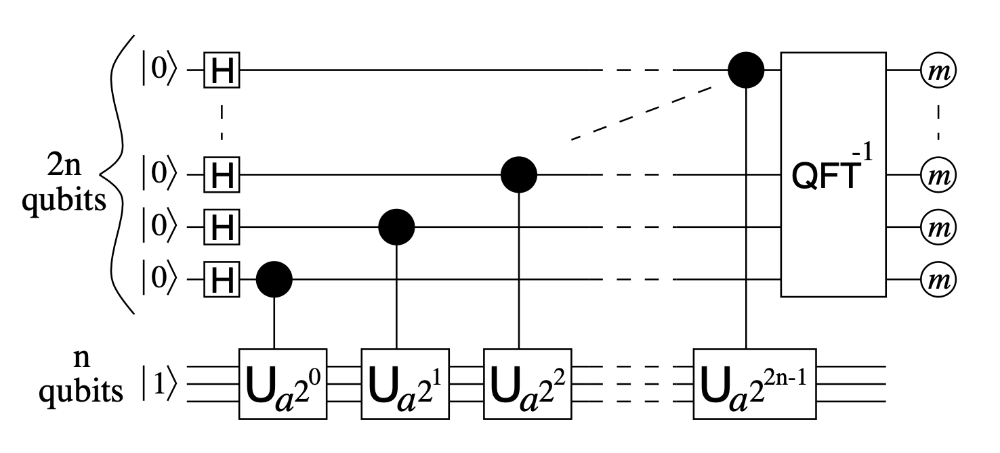

# Shor's factorization algorithm

Code at: [https://github.com/Quantum-TII/qibo/tree/shor/examples/shor](https://github.com/Quantum-TII/qibo/tree/shor/examples/shor)

The original paper by Shor [arXiv:9508027](https://arxiv.org/abs/quant-ph/9508027) stated that the discrete logarithm problem and factorization could be reduced to order finding. Then, Shor proposed an order finding algorithm using a quantum computer that would run in polynomial time. 

A circuit proposal for Shor's algorithm, mainly on the construction of a quantum modular exponentiation, followed shortly [arXiv:9511018](https://arxiv.org/abs/quant-ph/9511018) by Vedral, Barenco and Ekert. This implementation required 7n+2 qubits, where n refers to the number of bits needed to encode the number to factorize.

The following years, more proposals were introduced that decreased the number of qubits needed for the algorithm. This example is based on the Shor's algorithm implementation put forward by Beauregard [arXiv:0205095](https://arxiv.org/abs/quant-ph/0205095) in which the number of qubits needed is reduced to only 2n+3.

#### Quantum order finding algorithm

The aim of this algorithm is to find the least integer r>0 such that x^r = 1 mod N.

- Start from state |00...00>|00...01>.
- Create full superposition on the first register.
- Apply modular exponentiation to second register such that ~|j>|x^j mod N>.
- Apply inverse Quantum Fourier tranform on the first register.
- Measure the first quantum register. The result, divided by the maximum possible value, can be interpreted as ~(s/r).
- Use the continued fractions algorithm to estimate the value of r.

The order finding algorithm on a quantum circuit looks like the following.

#### Quantum factorization of number N

The order finding algorithm can be used as a subroutine to factorize a number N.

To find a non-trivial factor of N:

- If N is even, return the factor 2.
- Check if N = a^b for integers a > 1 and b > 2.
- Choose x randomly in range(1, N-1). If gcd(x, N) > 1 return it as a factor.
- Use the quantum order finding algorithm to find order r of x modulo N.
- If r is even and x^(r/2) is not equal to -1 mod N. Compute gcd(x^(r/2) - 1, N) and gcd(x^(r/2) + 1, N) and check if they are non-trivial factors of N.

This algorithm has a chance to fail, as not all random values of x will output an even value for r. In that case, the algorithm has to be re-run. It also might be the case that the output of the quantum computer is close, but not exactly the peak we are looking for, in that case, the algorithm could also fail. Regardless, Shor argues that repeating the experiment O(log(log(N))) times is enough to find the solution with high probability.

This can be increased to O(1) if the result of the quantum computer is enhanced by classicaly trying variations on the output of the quantum computer if quantum resources are scarce.

#### Qubit reduction techniques

Beauregard achieves a qubit reduction to 2n+3 due to two main modifications. 

##### Fixing x and N

Since the values for x and N are fixed before entering the quantum computer, they do not need to be stored in a quantum register. This benefits some reversible quantum addition algorithms more than others. In particular, performing the addition in Fourier space only requires n+1 qubits for adding two n-bit numbers when one of them is fixed.

Where the repeated gate can be computed classically ahead of time and just added to the system as a RZ (U1) gate.

##### One-qubit controlling trick

Since the controlled gates that apply the modular exponentiation commute, instead of using all 2n qubits to perform the inverse Quantum Fourier tranform, a single qubit can act as a control by performing multiple measurements on it.

The single qubit at the top register will be measured 2n times, and will be reset to |0> accordingly. Additionally, the Rotation gates applied to the qubit will depend on all the previeos measuements recorded. This can be interpreted as a semiclassical implementation of the inverse Quantum Fourier transform.

### Running the code

This example contains two files
- `functions.py` contains all functions necessary to run Shor's factorization algorithm.
- `main.py` is the file where the functions are assembled so that a given number N can be factorized.

Certain parameters can be given to the main file in order to tune the example.
- `N`: number to factorize. Recomended to be the multiplication of two prime numbers. Minimum number possible is 15. `default = 15`
- `times`: maximum number of tries for the algorithm to find the prime numbers. `default = 10`
- `A`: fix the value used for order finding. If `None` the value is chosen randomly. `default = None`
- `semiclassical`: flag to perform the iQFT in a semiclassical way. This achieves the final scaling of 2n+3 (4n+2 instead).
- `enhance`: flag to enhance the quantum result classically in order to find the solution in less iterations.

This example returns a comprehensible step by step analysis of Shor's factorization algorithm, culmination with two non-trivial factors of given number N.

